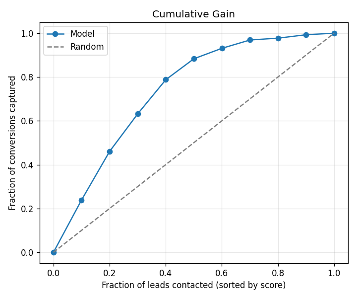
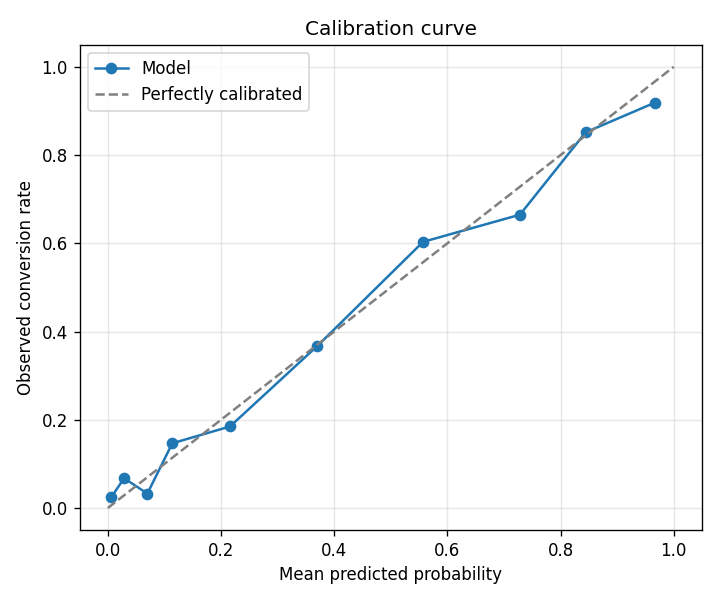
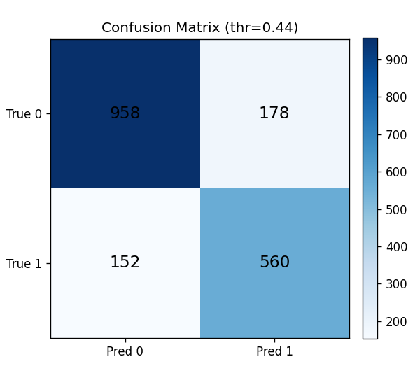

# Lead Priority — Lead Scoring + Engagement Sentiment + Birleşik Öncelik Skoru

CRM satış ekiplerinin "bugün hangi lead'i arayayım?" sorusuna **veriyle** cevap veren
uçtan uca bir sistem. İki sinyali birleştirir:

1. **Lead Scoring** — bir lead'in kazanılma (`Converted`) olasılığını tahmin eden, kalibre
   edilmiş bir gradient boosting modeli.
2. **Engagement Sentiment / Intent** — lead ile yapılan etkileşim metinlerinin (TR + EN)
   tonunu/niyetini 4 sınıfa ayıran, **fine-tune edilmiş çok dilli transformer**
   (`distilbert-base-multilingual-cased`, XLM-R'a geçilebilir).

Bu ikisi tek bir **öncelik skoruna** birleşir ve sabah dashboard'ında
(`GET /dashboard/brief`) **"şu 5 lead'i bugün ara, bu üçü soğuyor"** aksiyonunu üretir.

> **Not (genişlik vs derinlik):** Görevdeki "derinliği genişliğe tercih ederiz" yönergesine
> uyarak, lead scoring (kalibrasyon + lift/gain + leakage), sentiment (çok dilli transformer
> fine-tune) ve servis/dashboard katmanlarında derinleştik. Sentiment verisinin **sentetik**
> olması bilinçli bir kısıt; bunun sonuçları "Sentiment" bölümünde dürüstçe tartışıldı.

---

## İçindekiler

- [Mimari](#mimari)
- [Hızlı başlangıç](#hızlı-başlangıç)
- [Proje yapısı](#proje-yapısı)
- [Veri ve leakage tartışması](#veri-ve-leakage-tartışması)
- [1. EDA ve feature engineering](#1-eda-ve-feature-engineering)
- [2. Lead scoring modeli](#2-lead-scoring-modeli)
- [3. Sentiment / niyet analizi](#3-sentiment--niyet-analizi)
- [4. Birleşik öncelik skoru](#4-birleşik-öncelik-skoru)
- [5. API](#5-api)
- [6. Karar dökümü (sorular)](#6-karar-dökümü)
- [Future work](#future-work-3-günde-yetişmeyenler)

---

## Mimari

```
                 ┌──────────────────────────┐
   lead features │   Lead Scoring (LightGBM  │  P(convert)  ┐
  ───────────────►   + isotonic calibration) │──────────────┤
                 └──────────────────────────┘               │   ┌───────────────┐
                                                             ├──►│  Priority      │  priority_score
                 ┌──────────────────────────┐               │   │  (weighted +   │  + tier
  interaction    │  Sentiment/Intent         │ sentiment_score│  │  reachability) │
  text (TR/EN) ──►  (fine-tuned multilingual │──────────────┘   └───────────────┘
                 │   DistilBERT / XLM-R)     │
                 └──────────────────────────┘

  Dashboard:  GET /dashboard/brief  →  { call_today: [...],  cooling: [...] }
```

Eğitim/keşif (EDA, deneyler) `notebooks/` içinde; **servis edilebilir kısım**
(`src/lead_priority/`) modüler, type-hint'li, test edilen production kodu. API bu paketi
import eder; notebook'tan kopyalanmış tek dosyalık servis **yoktur**.

---

## Hızlı başlangıç

> Komutlarda `python3` kullanın. Bazı sistemlerde bare `python` komutu yoktur
> (`bash: python: command not found`). Sisteminizde `python` çalışıyorsa onu da
> kullanabilirsiniz; `Makefile` varsayılan olarak `python3` kullanır (`make train PYTHON=python`
> ile değiştirilebilir).

```bash
# 1) Bağımlılıklar + paket (editable). requirements.txt PyTorch'un CPU build'ini çeker.
python3 -m pip install -r requirements.txt
python3 -m pip install -e .

# 2) Veriyi hazırla (Leads.csv yoksa indirir; sentetik etkileşimleri ve demo lead'leri üretir)
python3 -m scripts.prepare_data

# 3) Modelleri eğit: LightGBM (~10-15 sn) + transformer fine-tune (CPU'da ~3 dk; ilk çalıştırmada
#    DistilBERT-multilingual ~540MB indirilir). Grafikleri reports/ altına yazar.
python3 -m scripts.train_all
#   python3 -m scripts.train_all --quick --no-plots   # lead-scoring araması için hızlı mod

# 4) API'yi çalıştır (port doluysa --port 8001 deneyin)
python3 -m uvicorn lead_priority.api.main:app --host 0.0.0.0 --port 8000
# Swagger UI:  http://localhost:8000/docs

# 5) Testler
python3 -m pytest -q
```

`Makefile` kısayolları da var: `make install`, `make train`, `make test`, `make serve`,
`make docker-build`, `make docker-run`.

### Docker

```bash
docker build -t lead-priority:latest .   # build: veri hazırlar + LightGBM + transformer fine-tune
docker run --rm -p 8000:8000 lead-priority:latest   # (build, transformer indirme+fine-tune yüzünden birkaç dk)
curl localhost:8000/health
```

### Örnek istek

```bash
curl -s -X POST localhost:8000/score -H 'Content-Type: application/json' -d '{
  "features": {
    "Lead Origin": "Landing Page Submission", "Lead Source": "Google",
    "TotalVisits": 7, "Total Time Spent on Website": 1600, "Page Views Per Visit": 3.5,
    "Last Activity": "SMS Sent", "What is your current occupation": "Working Professional",
    "Do Not Email": "No", "Do Not Call": "No"
  },
  "interaction_text": "Müşteri çok ilgili, demo talep etti ve hemen başlamak istiyor."
}'
```

```json
{
  "conversion_probability": 0.9595, "conversion_prediction": 1,
  "sentiment": {"label": "positive_engagement", "scores": {...}, "sentiment_score": 0.98},
  "priority": {"priority_score": 0.9656, "tier": "hot", "conversion_weight": 0.7, "reachable": true},
  "is_cooling": false
}
```

### Sabah brief'i (satış temsilcisi dashboard'ı)

```bash
curl -s "localhost:8000/dashboard/brief?n_call=5&n_cooling=3"
# -> { "call_today": [ {lead_id, tier, priority_score, ...} x5 ],   # "bu 5'ini ara"
#      "cooling":    [ {lead_id, conversion_probability, sentiment_label, ...} x3 ] }  # "bu 3'ü soğuyor"
```

---

## Proje yapısı

```
src/lead_priority/
├── config.py                 # yollar, kolon politikası, leakage listesi, sabitler
├── data/
│   ├── download.py           # Leads.csv'yi indir (yoksa)
│   ├── loaders.py            # ham veriyi yükle + "Select" -> NaN
│   └── synthetic_interactions.py  # TR+EN sentetik etkileşim üreteci (4 sınıf)
├── features/engineering.py   # leakage-aware feature engineering (sklearn transformer)
├── scoring/
│   ├── train.py              # LogReg baseline + LightGBM tuning + kalibrasyon
│   ├── evaluate.py           # AUC/PR/Brier, gain/lift, calibration, grafikler
│   └── model.py              # LeadScorer (serving wrapper)
├── sentiment/
│   ├── train.py              # DistilBERT/XLM-R multilingual fine-tune (PyTorch)
│   └── model.py              # SentimentClassifier (transformer serving wrapper, batch)
├── priority/combine.py       # birleşik öncelik skoru + "cooling" (at-risk) tespiti
└── api/                      # FastAPI: /score, /leads/top, /dashboard/brief, /health
scripts/                      # prepare_data.py, train_all.py
notebooks/01_eda_and_modeling.ipynb
tests/                        # features, sentiment, priority, API testleri
```

---

## Veri ve leakage tartışması

### Kaynak 1 — Tabular (lead scoring)

**X Education Lead Scoring Dataset** (Kaggle), ~9,240 lead, 37 kolon, hedef `Converted`
(dönüşüm oranı **%38.5** → orta düzey sınıf dengesizliği). `data/raw/Leads.csv` repoda mevcut;
yoksa `ensure_leads_csv()` public bir mirror'dan indirir.

### Kaynak 2 — Etkileşim metni (sentiment)

Tabular veride anlamlı bir serbest-metin alanı **yok**. Bu yüzden seçenek **(a)+(c)**:
şablon tabanlı **sentetik etkileşim notları** üretiyoruz (TR + EN karışık), her not bir
niyet sınıfından (`positive_engagement / objection / disengaged / neutral`).

### ⚠️ Leakage riski — bu projenin en kritik noktası

İki ayrı leakage cephesi var ve ikisi de bilinçli olarak ele alındı:

**(1) Tabular target leakage.** X Education veri setinde bazı kolonlar dönüşümü neredeyse
*mükemmel* tahmin eder ama bunun nedeni **satış sürecinin sonucunu içermeleridir**:

| Kolon | Neden leakage |
|---|---|
| `Tags` | `"Closed by Horizzon"`, `"Will revert after reading email"` gibi değerler rep tarafından lead kapanırken atanır. Bazı tag'lerin dönüşümü ~%100 / ~%0. |
| `Lead Quality` | İnsan tarafından sonradan verilen kalite yargısı. |
| `Last Notable Activity` / `Lead Profile` | Süreç ilerledikçe güncellenir. |
| `Asymmetrique *` | Sonradan hesaplanan skorlar. |

Bunların hepsi `config.LEAKY_COLUMNS` içinde tutulur ve **modelden düşürülür**. Eğer
bunları bıraksaydık offline AUC ~0.97'ye fırlardı ama model *yeni, taze bir lead* için
işe yaramazdı — çünkü o anda bu alanlar henüz boştur. Notebook'ta `Tags` vs `Converted`
karşılaştırması bunu görselleştiriyor.

**(2) Sentetik metin → hedef leakage.** Sentetik not üretirken niyet etiketini
`Converted`'a **bağlamadık**. Sonuçları:

- Sentiment modeli yalnızca `text → intent` öğrenir; `Converted` bilgisini hiç görmez.
- Demo lead listesinde de (`/leads/top`) nota atanan niyet `Converted`'tan **bağımsız**
  seçilir (`conversion_aware=False`). Yani birleşik skora cevabı gizlice sızdırmıyoruz.
- Eğer sentetik notları gerçek dönüşüme göre üretseydik, sentiment "ücretsiz" bir hedef
  kopyası olur ve hem sentiment hem birleşik skor sahte yüksek performans gösterirdi.

**Train/test hijyeni:** Tüm imputation, scaling ve one-hot encoding bir scikit-learn
`Pipeline`/`ColumnTransformer` içindedir ve **sadece train split'inde** fit edilir.
Operasyon eşiği (threshold) train'den ayrılan bir iç validation split'inde seçilir; test
seti yalnızca final raporlama için kullanılır.

---

## 1. EDA ve feature engineering

EDA (`notebooks/01_eda_and_modeling.ipynb`): dönüşüm oranı (%38.5), sınıf dengesizliği,
eksik veri paterni (`Lead Quality`, `Asymmetrique *`, `Tags` ağır eksik), ve **kaynak bazında**
dönüşüm farkları (ör. `Reference` / `Welingak Website` kaynakları genel ortalamanın çok
üzerinde dönüşüyor).

Üretilen feature'lar (`features/engineering.py`) ve **neden**:

| Feature | Tanım | Gerekçe |
|---|---|---|
| `time_per_visit` | site süresi / ziyaret | Ziyaret başına derinlik = gerçek ilgi |
| `total_page_views` | sayfa/ziyaret × ziyaret | Toplam etkileşim hacmi |
| `log_time_spent` | `log1p(süre)` | Süre ağır sağ-çarpık; log stabilize eder |
| `channel_diversity` | "Yes" işaretli kanal sayısı | **Kanal çeşitliliği** — çok kanaldan değen lead daha sıcak |
| `missing_field_count` | satırdaki boş alan sayısı | Eksiklik kalitesizlik sinyali |
| `do_not_contact` | email **veya** telefon opt-out | Ulaşılabilirlik |
| `is_working_professional` | meslek = Working Professional | Bu segment belirgin daha yüksek dönüşüyor |
| `is_high_intent_source` | referans/partner kaynak | Yüksek-niyet kaynak bayrağı |

> Görevde örnek verilen "son temas üzerinden geçen gün" gibi feature'lar X Education
> veri setinde **zaman damgası olmadığı için** üretilemedi; bunun yerine veri setinin
> desteklediği davranışsal/etkileşim feature'larına odaklandık. Gerçek bir CRM'de
> `days_since_last_contact`, `n_calls_last_7d` gibi recency/frequency feature'ları ilk
> eklenecekler olurdu (bkz. Future work).

---

## 2. Lead scoring modeli

- **Baseline:** Logistic Regression (`class_weight="balanced"`) — yorumlanabilirlik için.
- **Modern:** LightGBM + `RandomizedSearchCV` (ROC-AUC, 3-fold) hyperparameter tuning,
  ardından **isotonic kalibrasyon** (`CalibratedClassifierCV`) — skorlar gerçek olasılık
  gibi kullanılabilsin diye.

Sadece accuracy/AUC değil; **calibration (Brier)**, **precision/recall trade-off**,
**gain/lift** ve **top-%20 capture** raporlanır.

### Sonuçlar (held-out test, n=1,848)

| Model | ROC-AUC | PR-AUC | Brier ↓ | F1 |
|---|---|---|---|---|
| Logistic Regression (baseline) | 0.876 | 0.811 | 0.142 | 0.753 |
| **LightGBM (calibrated)** | **0.890** | **0.835** | **0.129** | **0.772** |

- **Top %20 lead → tüm dönüşümlerin %46.1'i** yakalanıyor (lift ≈ **2.3×**), ve bu üst
  %20 dilimde precision **%88.7**. Yani rep'ler listenin tepesindeki lead'lerin neredeyse
  9'da 1'ini değil, ~9'da 8'ini kazanıyor.
- Seçilen operasyon eşiği: **0.44** (iç validation'da F1-optimal).
- LightGBM hem ayrımı (AUC/PR) hem kalibrasyonu (daha düşük Brier) baseline'a göre iyileştirdi;
  ufak ama tutarlı bir kazanım. Veri çoğunlukla düşük-kardinaliteli kategorik + birkaç
  sayısal olduğu için baseline zaten güçlü — bu beklenen bir sonuç.

Grafikler (`reports/`, `train_all` ile üretilir):





---

## 3. Sentiment / niyet analizi

4 sınıf: `positive_engagement` (ilgili, soru soruyor), `objection` (fiyat/zaman itirazı),
`disengaged` (kısa, mesafeli), `neutral`.

**Yaklaşım — önceden eğitilmiş çok dilli transformer + fine-tune.** Varsayılan model
`distilbert-base-multilingual-cased` (135M); `config.SENTIMENT_BASE_MODEL` ile
`xlm-roberta-base`'e tek satırda geçilebilir. `sentiment/train.py` PyTorch ile saf bir
fine-tune döngüsü çalıştırır (HF `Trainer`'a bağımlı değil — şeffaf ve az bağımlılık).

**Türkçe + İngilizce karışımı nasıl ele alınıyor:**
- Model çok dilli bir **paylaşılan sub-word sözlüğü** ile ön-eğitilmiştir; TR ve EN aynı
  temsil uzayına gömülür. "fiyatı yüksek buldu" ile "too expensive" birbirine yakın düşer.
- **Dil tespiti / ayrı pipeline yok**: tek model her iki dili de işler. Eğitim verisi hem
  TR hem EN şablonları içerir (notebook'ta dil dağılımı: ~yarı yarıya).
- **Neden fine-tune > zero-shot:** göreve özgü 4 CRM niyetimiz için etiketimiz var; küçük,
  hızlı ve kendi kendine yeten bir servis artefaktı, çok-GB'lık bir LLM'den daha uygun.
- **GPU yok** kısıtı: DistilBERT-multilingual CPU'da 3 epoch ~**3 dk**'da fine-tune oluyor;
  inference tek lead'de milisaniyeler, dashboard'da tüm lead'ler **tek batch forward**.

**Dürüst caveat (önemli):** Sentetik test setinde accuracy/macro-F1 ≈ **1.0**. Bu *gerçek*
bir başarı değil — transformer da, TF-IDF de bu sınırlı şablon setini kolayca ezberler.
Buradaki darboğaz **model değil, veri**: sentetik metin gerçek müşteri dilinin gürültüsünü,
ironiyi, kod-değişimini (code-switching) içermez. Bu sayıyı "model kalitesi" değil,
**boru hattının uçtan uca çalıştığının** kanıtı olarak sunuyoruz. Transformer'ı seçmemizin
asıl değeri, **gerçek etiketli veri geldiğinde** (Future work) ezberden genellemeye geçişi
mümkün kılmasıdır — TF-IDF'in tavanı çok daha düşüktür.

`sentiment_score ∈ [0,1]`: sınıf olasılıklarının `config.SENTIMENT_PRIORITY_WEIGHT` ile
beklenen değeri (positive=1.0, objection=0.55, neutral=0.40, disengaged=0.10). İtirazın
0 değil 0.55 olması bilinçli: itiraz bir **satın alma sinyalidir** ve rep müdahalesi ister.

---

## 4. Birleşik öncelik skoru

```
priority = w · P(convert) + (1 − w) · sentiment_score        (w = 0.7 varsayılan)
```

artı bir **ulaşılabilirlik kapısı**: lead hem email hem telefon opt-out yaptıysa skor
sönümlenir (arayamadığınız yüksek-olasılıklı lead aksiyon alınabilir değildir). Skor
4 tier'e ayrılır: `hot / warm / cooling / cold`.

**Neden meta-model değil de şeffaf ağırlıklı kombinasyon?**

- **Açıklanabilirlik:** Rep'in her sabah güvenip aksiyon alacağı bir sayı. "Yüksek çünkü
  P(convert)=0.82 ve son e-posta olumluydu" > "meta-model öyle dedi".
- **Sentetik metinle sağlamlık:** Sentiment (sentetik) + dönüşüm (gerçek) üzerine stacking
  bir meta-model, üreteç şablonlarının yapay örüntülerini öğrenir ve sentetik korelasyonu
  dönüşüm sinyaline sızdırma riski taşır.
- **Ürün tarafından ayarlanabilir:** Product, yeniden eğitim olmadan `conversion_weight`'i
  oynatabilir (API'de `conversion_weight` query/body parametresiyle override edilebilir).

"Mükemmel formül" değil, **ürün sezgisi** hedeflendiği için bilinçle basit ve okunaklı.

**"Soğuyan" (at-risk) lead tespiti.** Dashboard'ın "bu üçü soğuyor" yarısı için ayrı bir
kural: lead **değerliydi** (P(convert) ≥ 0.45) ama son etkileşimi **disengaged/objection**
ise `is_cooling=True`. Böylece rep, hiç sıcak olmamış lead'lerin peşinde koşmak yerine
**kaybedilmek üzere olan değerli** fırsatları kurtarır (`priority/combine.py: is_cooling`).

---

## 5. API

FastAPI, dört endpoint (Swagger: `/docs`):

| Method | Path | Açıklama |
|---|---|---|
| `GET` | `/health` | Liveness + modeller yüklü mü |
| `POST` | `/score` | Lead feature'ları + son etkileşim metni → P(convert) + sentiment + öncelik + `is_cooling` |
| `GET` | `/leads/top?n=5` | Lead listesini öncelik skoruna göre sıralar, en öncelikli N'i döner |
| `GET` | `/dashboard/brief` | **Sabah brief'i**: `call_today` (bugün ara) + `cooling` (soğuyanlar) |

- `/dashboard/brief` görevdeki senaryoyu doğrudan karşılar: "şu 5 lead'i bugün ara, bu üçü
  soğuyor". Tüm lead'ler **tek batch** transformer + tek tahmin geçişiyle skorlanır.
- Her istek **loglanır** (method, path, status, latency); `LOG_LEVEL` env ile ayarlanır.
- Modeller startup'ta (lifespan) **bir kez** yüklenir; artefakt yoksa API ayağa kalkar ama
  ilgili endpoint'ler `503` döner (graceful degradation).
- Girdi/çıktı Pydantic şemalarıyla doğrulanır.

---

## 6. Karar dökümü

### Veri etiketleme/üretme stratejisi ve leakage
Yukarıdaki [Veri ve leakage](#veri-ve-leakage-tartışması) bölümü. Özet: tabular tarafta
süreç-sonrası kolonlar düşürüldü; sentetik metin etiketi `Converted`'tan bağımsız üretildi;
tüm preprocessing pipeline içinde sadece train'de fit edildi.

### Model seçimleri ve trade-off'lar
- LogReg: hızlı, yorumlanabilir, güçlü baseline; doğrusal olmayan etkileşimleri kaçırır.
- LightGBM + kalibrasyon: en iyi ayrım + güvenilir olasılık; biraz daha az şeffaf
  (SHAP ile telafi edilebilir). Tuning maliyetini düşürmek için iç-içe paralelliği kapattık
  (LightGBM `n_jobs=1`, arama `n_jobs=-1`) — aksi halde 4 CPU'da oversubscription kilitliyor.
- Sentiment: fine-tune edilmiş çok dilli **DistilBERT** (XLM-R'a geçilebilir). TR+EN'i tek
  paylaşılan sözlükle ele alır; göreve özgü etiketlerimiz olduğu için fine-tune, zero-shot
  LLM'e tercih edildi. CPU'da ~3 dk fine-tune; küçük, hızlı, self-contained artefakt.

### Sonuçlar
LightGBM ROC-AUC **0.890** / PR-AUC **0.835** / Brier **0.129**; top-%20 capture **%46**,
lift **2.3×**. Confusion matrix + gain + calibration grafikleri `reports/` altında.
Sentiment (DistilBERT-multilingual fine-tune) sentetik test metrikleri ~1.0 — bu sayının
neden gerçek başarı sayılmaması gerektiği [Sentiment](#3-sentiment--niyet-analizi) caveat'inde.

### Production'a girse — drift, retrain, feedback
- **İzlenecek feature drift'i:** girdi dağılımları (`Lead Source`/`Lead Origin` mix,
  `Total Time Spent on Website`, `channel_diversity`), kategorik seviyelerde yeni/yok olan
  değerler, ve **eksiklik oranları** (`missing_field_count` artışı tipik bir entegrasyon
  bozulması işareti). Tahmin tarafında: skor dağılımı kayması ve **kalibrasyon drift'i**
  (gözlenen dönüşüm vs tahmin) — PSI ve rolling Brier ile.
- **Retrain sıklığı:** planlı olarak aylık; tetikleyici tabanlı olarak PSI/kalibrasyon
  eşik aşımında. Sezonluk kampanyalar lead karışımını hızlı değiştirebildiğinden, tetikleyici
  tabanlı yaklaşım takvime tercih edilir.
- **Rep geri bildirimi:** her skor için `lead_id`, model versiyonu ve skor loglanır; rep'in
  gerçek aksiyonu + nihai sonuç (converted/lost) ile eşleştirilip etiketli eğitim verisine
  geri beslenir. "Bu skor yanlıştı" gibi açık geri bildirim de toplanır; bu hem yeni etiket
  hem drift erken-uyarısıdır. Sentiment tarafında rep'in not'a verdiği gerçek etiketler
  sentetik veriyi **gerçek** veriyle değiştirmenin yoludur.

### False positive maliyeti
Yanlış yüksek skor verilen bir lead rep'in yarım gününü yer. Bu yüzden:
- **Kalibrasyon** birinci savunma: 0.8 gerçekten ~%80 olsun ki rep beklentisi doğru olsun.
- Eşik tek başına F1 ile değil, **iş maliyetiyle** seçilmeli: temas başına rep zamanı ile
  kazanılan müşteri değeri arasındaki orana göre precision-recall noktası ayarlanır
  (precision'ı yükseltmek = daha az boşa arama). Altyapı hazır (eşik konfigüre edilebilir,
  PR/lift raporlanıyor); burada F1-optimal eşik bir başlangıç.
- **Lift/capacity bazlı çalışma:** rep'in günde X kapasitesi varsa, eşik yerine "top-N"
  ile çalışmak doğal olarak en yüksek precision'lı dilimi hedefler.

### Etik / fairness
Lead scoring `Country` ve dolaylı demografi proxy'leri (`City`, `Specialization`) içerebilir;
bu modelin belirli ülke/segmentlere sistematik düşük skor vererek **kendini doğrulayan bir
döngü** yaratması riski gerçektir (düşük skor → daha az temas → daha az dönüşüm → daha düşük
skor). Önlemler: (1) korumalı/proxy özniteliklerde **grup bazında** capture/precision'ı
izlemek (fairness raporu), (2) gerekirse bu öznitelikleri çıkarmak veya yeniden ağırlıklamak,
(3) **açıklanabilirlik** — global + lead-bazlı SHAP ile "bu skor neden?" sorusuna cevap vermek.
Bu veri setinde cinsiyet yok ama `Country` baskın şekilde "India"; coğrafi yanlılık üretebilir.
Bu repoda fairness *altyapısı* (grup metrikleri) bir sonraki adım olarak işaretlendi.

---

## Future work (3 günde yetişmeyenler)

- **Recency/frequency feature'ları:** gerçek zaman damgalı etkileşimlerle
  `days_since_last_contact`, `n_touches_last_7d`, etkileşim kanalı sıralaması.
- **Gerçek etiketli sentiment:** transformer fine-tune altyapısı hazır (DistilBERT/XLM-R);
  eksik olan tek şey gerçek, etiketli yazışma verisi. Rep'lerin etiketlediği gerçek metinlerle
  fine-tune + **aktif öğrenme** ile etiket maliyetini düşürme; cooling kuralını öğrenilmiş
  bir "risk" modeline yükseltme.
- **SHAP açıklanabilirlik + fairness paneli:** `/score` yanıtına başlıca itici feature'lar;
  grup bazlı performans izleme.
- **Maliyet-duyarlı eşik optimizasyonu:** temas maliyeti / müşteri değeri ile expected-value
  bazlı eşik; rep kapasitesine göre günlük top-N.
- **MLOps:** model registry + sürümleme, batch scoring job, drift monitor (PSI/Brier) ve
  otomatik retrain tetikleyicisi; modelleri imaja gömmek yerine registry'den yüklemek.
- **A/B testi:** öncelik skorunun gerçekten dönüşüm/rep-verimliliğini artırdığını kanıtlamak.

---

## Lisans / veri
`Leads.csv` orijinal Kaggle lisansına tabidir. Bu repo eğitim/değerlendirme amaçlıdır.
